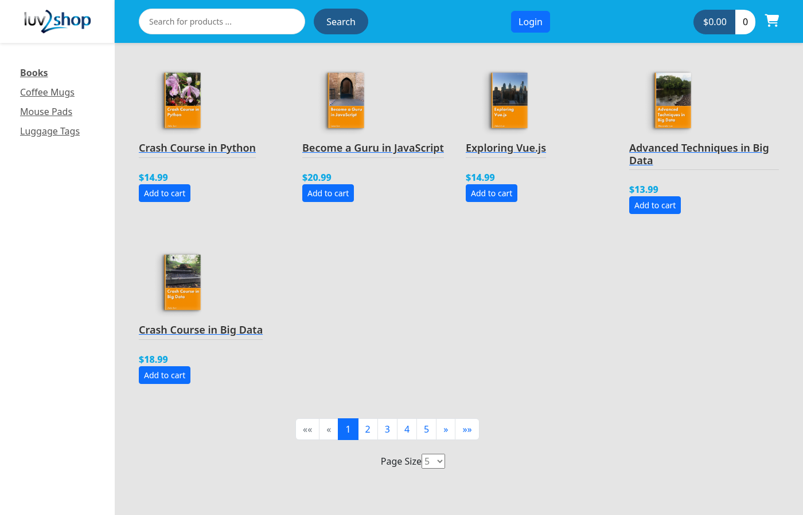
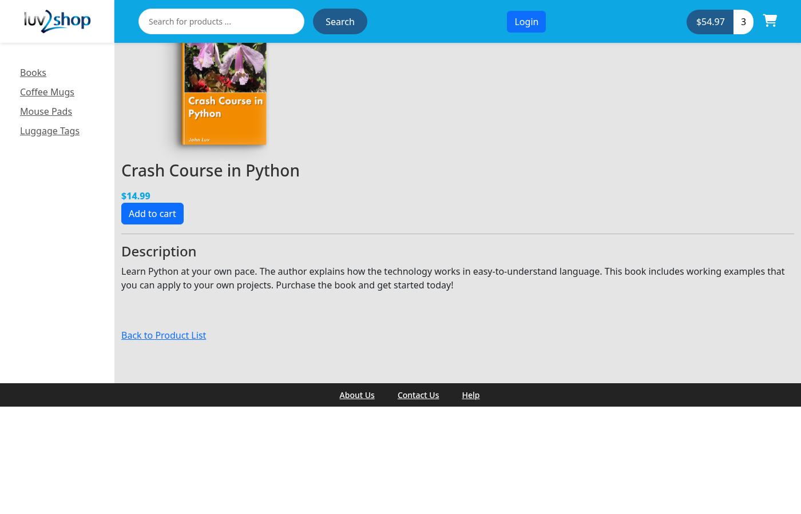
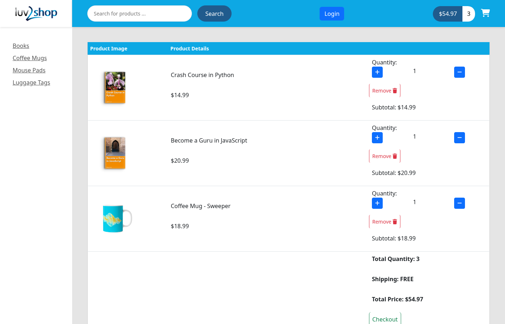
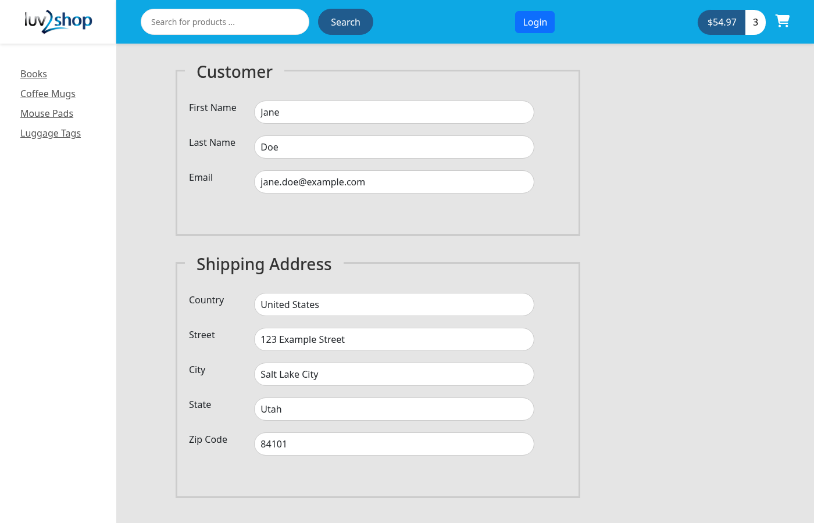

# Full-Stack E-Commerce Store (Angular + Spring Boot)

**luv2shop** is an online store with a Spring Boot REST API backed by MySQL and an Angular single-page front end. Shoppers can browse and search a product catalogue, manage a cart, and check out with card payments handled by Stripe.

I built it following Luv2Code's *Full Stack: Angular and Spring Boot E-Commerce* course by Chad Darby. The Java package (`com.luv2code.ecommerce`), the sample products and the "luv2shop" branding all come from the course.



| Product page | Cart | Checkout |
|---|---|---|
|  |  |  |

## Features

### Front end (Angular)
- Product grid with images and prices, plus a category menu built from the API
- Search products by name
- Pagination with a selectable page size (ng-bootstrap)
- Product detail page
- Shopping cart: add items, change quantities, remove items, and see running totals in the header. The cart is kept in `sessionStorage`.
- Checkout form built with reactive forms and validation: customer details, shipping address, billing address with a "same as shipping" option, and country and state drop-downs loaded from the API
- Card payments through Stripe Elements. The browser confirms a PaymentIntent created by the backend, so card details never reach this server.
- Login and logout with Auth0 (`@auth0/auth0-angular`). Order history and members pages are protected by a route guard.

### Back end (Spring Boot)
- Spring Data REST exposes read-only endpoints under `/api` for products, product categories, countries and states. PUT, POST, PATCH and DELETE are disabled for these.
  - `GET /api/products`, `/api/products/search/findByCategoryId?id=`, `/api/products/search/findByNameContaining?name=`
  - `GET /api/product-category`
  - `GET /api/countries`, `/api/states/search/findByCountryCode?code=`
- `POST /api/checkout/purchase` saves the customer, the shipping and billing addresses, the order and its items in one transaction, and returns a UUID order tracking number. A returning customer is matched by email.
- `POST /api/checkout/payment-intent` creates a Stripe PaymentIntent for the cart total.
- `GET /api/orders/search/findByCustomerEmailOrderByDateCreatedDesc?email=` requires a JWT. It is secured as an OAuth2 resource server through the Okta Spring Boot starter.
- CORS restricted to the configured front-end origin
- HTTPS on port 9898 using a PKCS12 keystore

## Tech stack

| Layer | Technology |
|---|---|
| Back end | Java 17, Spring Boot 3.4.2 (Web, Data JPA, Data REST, Validation, Security), Okta Spring Boot Starter 3.0.4, Stripe Java 28.3.1, springdoc-openapi 2.1.0, Lombok, MySQL Connector/J |
| Front end | Angular 19.1, TypeScript 5.7, RxJS 7.8, Bootstrap 5.2, ng-bootstrap 18, Font Awesome 6, Auth0 Angular SDK 2.3, Stripe.js v3 |
| Database | MySQL 8 (schema `full-stack-ecommerce`) |

## Project structure

```
.
├── 01-starter-files/
│   ├── db-scripts/
│   │   ├── 01-create-user.sql                     # creates the ecommerceapp MySQL user
│   │   ├── 02-create-products.sql                 # schema + a small product set
│   │   ├── 03-refresh-database-with-100-products.sql  # schema + 100 products (matches the images in the front end)
│   │   └── 04-countries-states-and-orders.sql     # country/state/customer/address/order tables + sample countries and states
│   └── spring-boot-properties/                    # reference application.properties from the course
├── 02-backend/spring-boot-ecommerce/              # Spring Boot API
│   └── src/main/java/com/luv2code/ecommerce/
│       ├── config/       # Data REST, CORS and security configuration
│       ├── controller/   # CheckoutController
│       ├── dao/          # Spring Data repositories
│       ├── dto/          # Purchase, PurchaseResponse, PaymentInfo
│       ├── entity/       # JPA entities
│       └── service/      # CheckoutService (orders + Stripe)
├── 03-frontend/angular-ecommerce/                 # Angular app
│   └── src/app/
│       ├── common/       # model classes
│       ├── components/   # product list/details, category menu, search, cart, checkout, login, order history
│       ├── services/     # product, cart, checkout, form data, order history
│       └── validators/
└── docs/screenshots/
```

## Running it locally

### Prerequisites
- Java 17 and Maven, or the included `mvnw` wrapper
- Node.js 18.19+ or 20+, and npm
- MySQL 8
- Optional: a Stripe account in test mode, for payments
- Optional: an Auth0 tenant, for login and order history

### 1. Database
The backend's default connection is `localhost:3307`, user `ecommerceapp`. Run the scripts in this order:

```bash
mysql -u root -p < 01-starter-files/db-scripts/01-create-user.sql
mysql -u root -p < 01-starter-files/db-scripts/03-refresh-database-with-100-products.sql
mysql -u root -p < 01-starter-files/db-scripts/04-countries-states-and-orders.sql
```

If your MySQL runs on 3306, set `DB_PORT=3306`.

### 2. Local HTTPS certificates
The backend and the Angular dev server both use HTTPS. Certificates are not committed, so generate self-signed ones for localhost:

```bash
# backend keystore (alias must be luv2code)
keytool -genkeypair -alias luv2code -keyalg RSA -keysize 2048 -storetype PKCS12 \
  -keystore 02-backend/spring-boot-ecommerce/src/main/resources/luv2code-keystore.p12 \
  -validity 365 -storepass changeit -dname "CN=localhost" -ext san=dns:localhost

# Angular dev server certificate
cd 03-frontend/angular-ecommerce
mkdir -p ssl-localhost
openssl req -x509 -nodes -newkey rsa:2048 -days 365 -config localhost.conf \
  -keyout ssl-localhost/localhost.key -out ssl-localhost/localhost.crt
```

Your browser will warn about self-signed certificates. Open https://localhost:9898/api/products once and accept the warning so the front end can call the API.

### 3. Back end
Configuration is read from environment variables. Each one has a local default:

| Variable | Purpose | Default |
|---|---|---|
| `DB_HOST` / `DB_PORT` | MySQL host and port | `localhost` / `3307` |
| `DB_USERNAME` / `DB_PASSWORD` | MySQL credentials | `ecommerceapp` / `ecommerceapp` |
| `KEYSTORE_PASSWORD` | password of `luv2code-keystore.p12` | `changeit` |
| `STRIPE_SECRET_KEY` | Stripe **test** secret key (`sk_test_...`) | placeholder, so payments fail until set |
| `OKTA_OAUTH2_ISSUER` | Auth0/Okta issuer URL, e.g. `https://dev-xxxx.us.auth0.com/` | placeholder |

```bash
cd 02-backend/spring-boot-ecommerce
export STRIPE_SECRET_KEY=sk_test_...      # optional
./mvnw spring-boot:run
```
The API runs at https://localhost:9898/api.

### 4. Front end
```bash
cd 03-frontend/angular-ecommerce
npm install
npm start          # ng serve over HTTPS using ssl-localhost/
```
Open https://localhost:4200.

- **Stripe:** put your Stripe test publishable key (`pk_test_...`) in `src/environments/environment.qa.ts`. `ng serve` uses this file by default. Test card: `4242 4242 4242 4242`, any future date and any CVC.
- **Auth0 (optional):** set `domain` and `clientId` in the `AuthModule.forRoot` block in `src/app/app.module.ts`, add `https://localhost:4200` to the allowed callback, logout and web origin URLs in Auth0, and set `OKTA_OAUTH2_ISSUER` for the backend.

Browsing, search, cart and the checkout form work without Stripe or Auth0 keys. Only the payment step and the login-protected pages need them.

## Known limitations
- The `production` build configuration replaces the environment with `environment.development.ts`, which has no `stripePublishableKey`. Payments only work in the default dev (`ng serve`) and `qa` configurations.
- The Auth0 HTTP interceptor's `allowedList` points at `http://localhost:8080/api/orders/*`, but the API runs on `https://localhost:9898`. The access token is therefore not attached to order-history requests.
- The order history page and the checkout email field read `userEmail` from `sessionStorage`, but nothing writes it after an Auth0 login.

## Security
No real API keys, client IDs or passwords are committed. Stripe, Auth0 and keystore secrets come from environment variables or local files that `.gitignore` excludes. The only credential in the repo is the course's local MySQL user `ecommerceapp`/`ecommerceapp`, which is meant for a local development database only.
